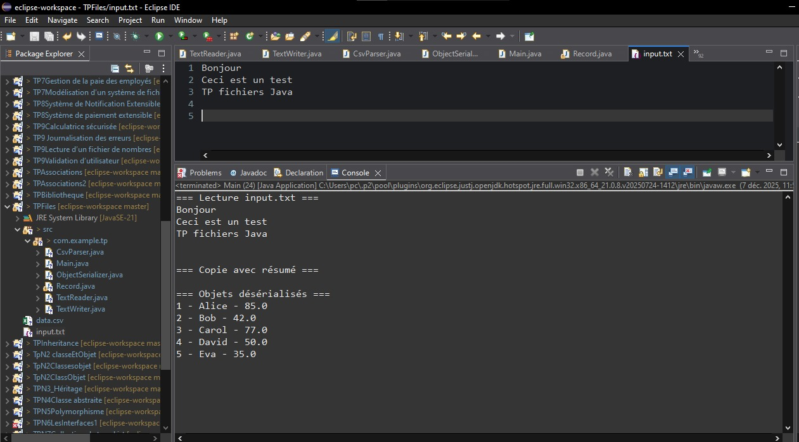
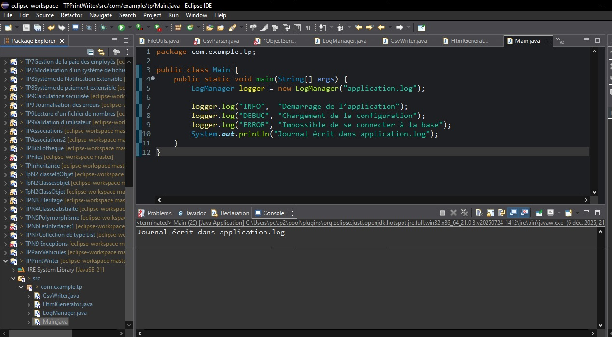
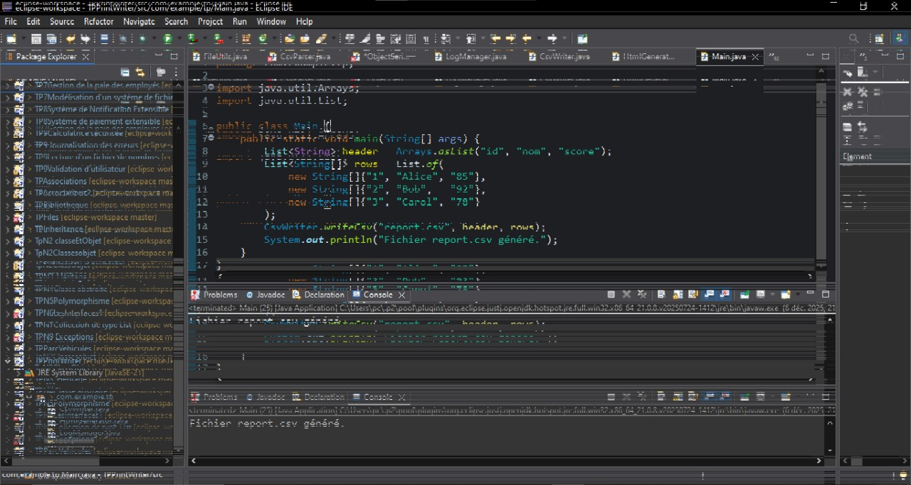

# 📘 — TP12

## 🎯 Objectif

Manipuler les fichiers en Java :

Lire / écrire des fichiers texte

Copier des fichiers

Lire et écrire des CSV

Sérialiser et désérialiser des objets

Utiliser PrintWriter et BufferedReader

## 🟦 PARTIE 1 — Exercice 1

FileReader / FileWriter / BufferedReader / BufferedWriter / Files

TextReader : lit un fichier texte ligne par ligne

TextWriter : copie un fichier et ajoute un résumé

CsvParser : lit un CSV (id,name,score) et écrit passed.csv

Record : modèle pour chaque ligne du CSV

ObjectSerializer : sérialise/désérialise une liste d’objets

FileUtils : utilitaires (existence, copie, suppression, lecture complète)

### Résultat visuel

  
<em>Figure 1</em>
 

## 🟧 PARTIE 2 — Exercice 2

PrintWriter & BufferedReader

LogManager : écrit un journal application.log

CsvWriter : génère un fichier CSV simple

HtmlGenerator : crée une page HTML (index.html)

Utilise PrintWriter.printf() pour formater les lignes

### Résultat visuel

  
<em>Figure 2.1</em>
 

  
<em>Figure 2.2</em>
 

  
<em>Figure 2.3</em>
 

▶️ Exécution
javac com/example/tp/*.java
java com.example.tp.Main

📎 Fichiers manipulés

input.txt, output.txt, data.csv, passed.csv,
records.ser, application.log, report.csv, index.html
